# Lab 1: Connect Bot to QnA Maker

## Abstract

In this lab, you will set up and run your first functional bot. It takes you beyond the basics by connecting your chat bot with a knowledge base deployed in Azure. Upon completion, developers should have:

* Installed the prerequisites to build a bot
* Learned the basics of a bot project
* Tested the bot using the Bot Framework Emulator
* Set up a knowledge base in Azure using the QnA Maker
* Tested the knowledge base on the QnA Maker website
* Exported and imported a knowledge base
* Integrated a bot application with the QnA Maker API

## Module 1: Set Up Tools

This module will walk you through the process of setting up the tools required to build and test your bot.

### Exercise 1: Install Visual Studio (Any Edition)

Any edition of Visual Studio 2017 will work for these labs, but it has not been tested on Visual Studio Code. The documentation for the lab was developed using Visual Studio 2017 Community.

#### L1M1E1 Step 1

Navigate to https://visualstudio.microsoft.com/downloads/

#### L1M1E1 Step 2

Choose an edition of Visual Studio. For this lab, any edition will work.

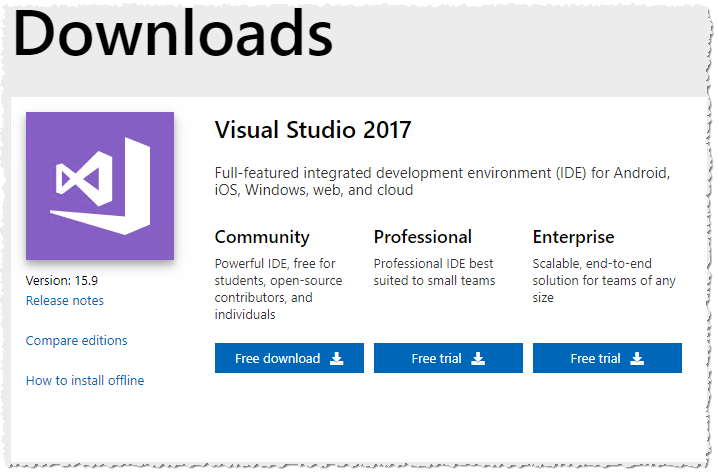

#### L1M1E1 Step 3

The download installs the installer (not Visual Studio itself). When the installer starts, select “ASP.NET and web development”, “Azure development”, and “.NET Core cross-platform development”. Click “Install”

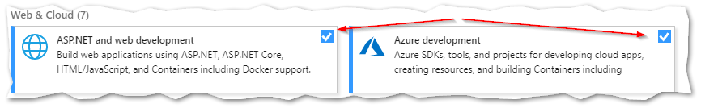

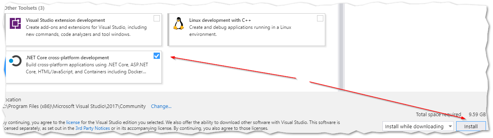

#### L1M1E1 Step 4

Wait

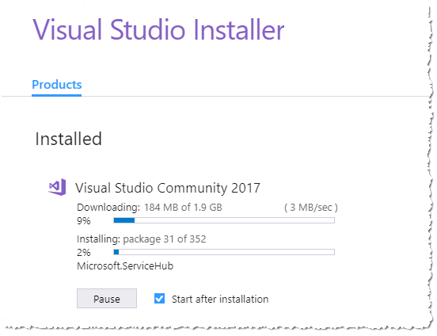

#### L1M1E1 Step 5

When it’s done, you’ll be asked to sign in. You can sign in or choose to do so later. Go ahead in sign in, because if you don’t do so now, you’ll have to do so in a few seconds.

### Exercise 2: Install Bot Framework Emulator

The Bot Framework Emulator allows you to test your bot locally.

#### L1M1E2 Step 1

Close Visual Studio and the Visual Studio Installer

#### L1M1E2 Step 2

Navigate to https://github.com/Microsoft/BotFramework-Emulator/releases and install the latest version

### Exercise 3: Install Bot Framework Template for Visual Studio

The Visual Studio templates allow developers quickly create bot projects.

#### L1M1E3 Step 1

Navigate to https://botbuilder.myget.org/gallery/aitemplates and choose the latest version of “Bot Builder SDK Template for Visual Studio”

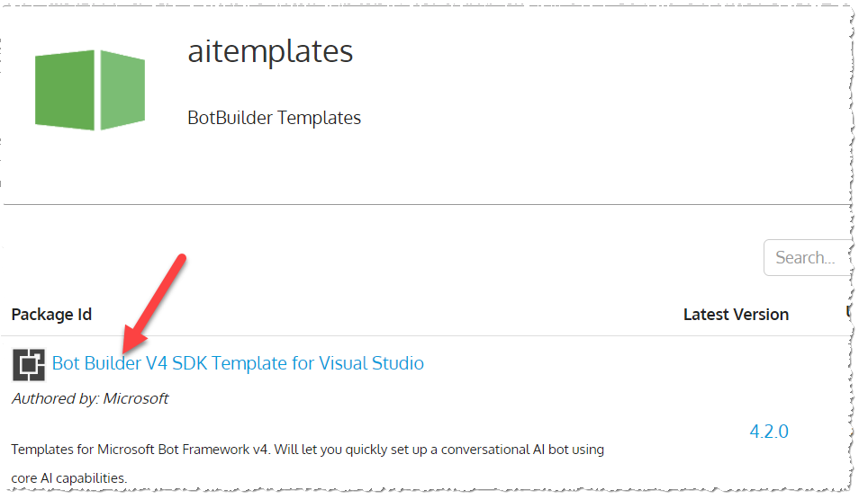

#### L1M1E3 Step 2

Download and install

> You will need to exit from all Visual Studio instances before the extension installation will continue.

#### L1M1E3 Step 3

Start Visual Studio (you should not need to restart Windows)

## Module 2: Create new Echo Bot Project

In this module, you will create and run a bot using the predefined templates provided to Visual Studio.

### Exercise 1: Create Basic EchoBot

The basic EchoBot provides developers with a working bot without needing to write any code. We are using this template so that we can see the interaction between the Bot Emulator and the bot application.

#### L1M2E1 Step 1

Create a new project

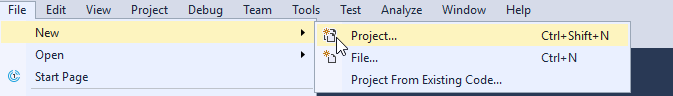

#### L1M2E1 Step 2

Create a new "Bot Builder Echo Bot V4" project

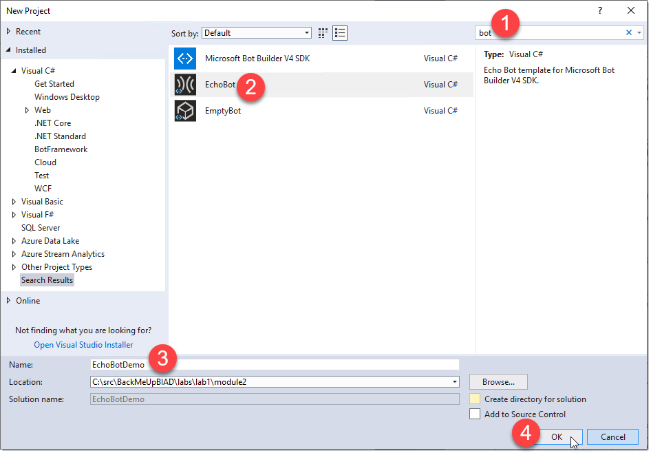

> As-Of 2019-01-23, this template uses a project file that is configured for .Net Core 2.1.x. For the sake of these exercises, it is not advisable to upgrade. If you want to upgrade your packages, you can do so by editing the project file and changing the "TargetFramework" to "netcoreapp2.2". You may need to download the latest SDK from https://dotnet.microsoft.com/download.

#### L1M2E1 Step 3

Start the project

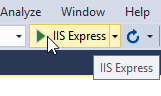

> The first time you build/start the app, it may take a few minutes. It will download all of the required NuGet packages to run the application.

### Exercise 2: Connect to EchoBot and Test It

The bot emulator allows us to test the bot logic locally. In the case of the Echo Bot, we will be able to observe the bot echoing back to the emulator anything we type in.

#### L1M2E2 Step 1

Start the Bot Framework Emulator

#### L1M2E2 Step 2

Click "Open Bot"

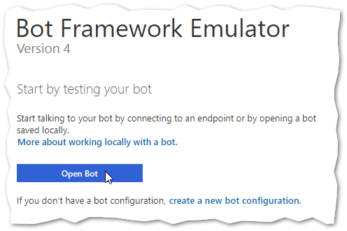

#### L1M2E2 Step 3

Select the BotConfiguration.bot file in the project you just created

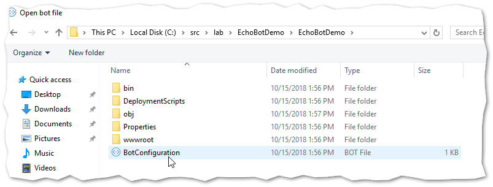

#### L1M2E2 Step 4

Type anything in the chat window. The EchoBot will respond by echoing back your message.

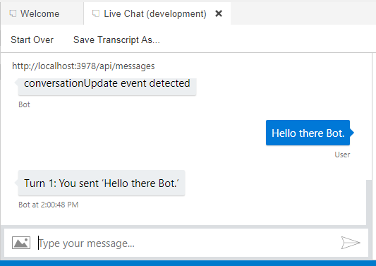

### Lab1 Module 2 Bonus Exercise 1

Work with a partner to identify where the turn is being processed. Modify the code to respond “Polo” when “Marco” is typed.

### Lab1 Module 2 Bonus Exercise 2

Look at how EchoBotAccessors.cs works. Modify it to save the user’s name if they type “My name is [name]”

### Lab1 Module 2 Bonus Exercise 3

Modify the bot to respond “Hello, it’s nice to meet you.” when the user types “hello”, but only the first time the user types “hello”. Double bonus if you have it include the user's name if provided in the previous bonus exercise.

## Module 3: Create a Knowledge Base in Azure

In this module, you will learn how to create and configure a knowledge base using the Microsoft QnA Maker. You will also create a bot from a blank project and connect it to the QnA Maker API to provide interactive knowledge base functionality.

### Exercise 3: Create QnA Service

#### L1M3E1 Step 1

Navigate to https://www.qnamaker.ai

#### L1M3E1 Step 2

If you have not signed in, do so now.

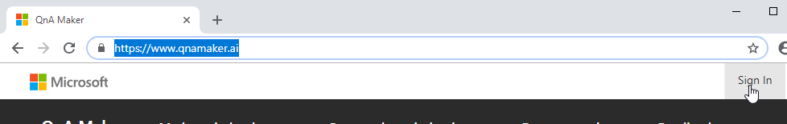

#### L1M3E1 Step 3

Click "Create a knowledge base"

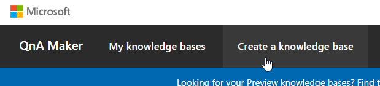

#### L1M3E1 Step 4

Create a QnA service in Azure

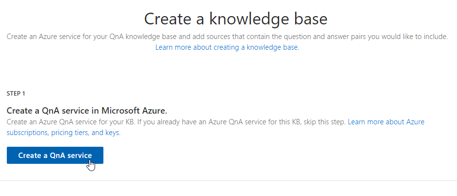

Image | Steps
--- | ---
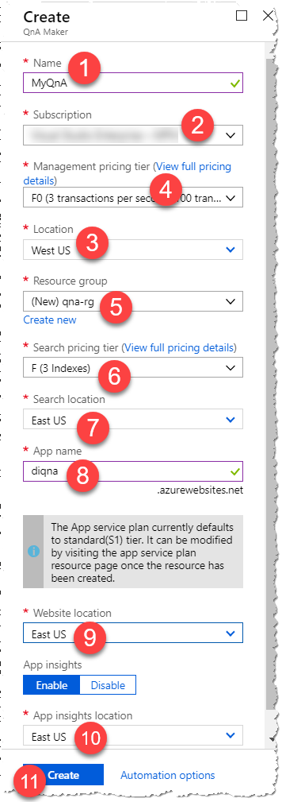 | <ol><li>Name the service</li><li>Choose a subscription (if you have more than one)</li><li>Choose the location of the service</li><li>Choose the tier (F0 is the free tier)</li><li>Choose an existing, or create a new resource group</li><li>Choose the Azure Search tier (F if the free tier)</li><li>Choose a location for the search service</li><li>Choose a globally unique name for the web application that will host the QnA service</li><li>Choose a location for the web application</li><li>Choose a location for Application Insights</li><li>Create the service</li></ol>

### Exercise 4: Create a Knowledge Base

#### L1M3E2 Step 1

Navigate to www.qnamaker.ai, and refresh the page. You should now be able to select the QnA service

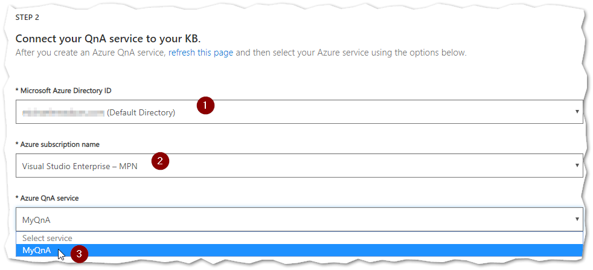

#### L1M3E2 Step 2

Name your KB. For this exercise, any name will do

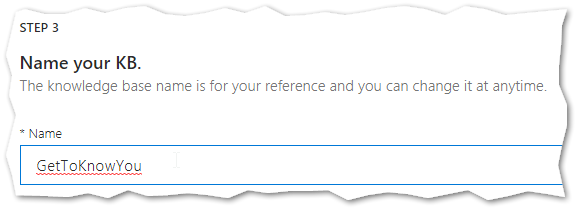

#### L1M3E2 Step 3

Skip "STEP 4". Click "Create your KB" in "STEP 5"

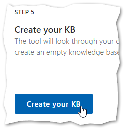

### Exercise 5: Add Questions and Answers to Knowledge Base

#### L1M3E3 Step 1

Click "Add QnA pair"

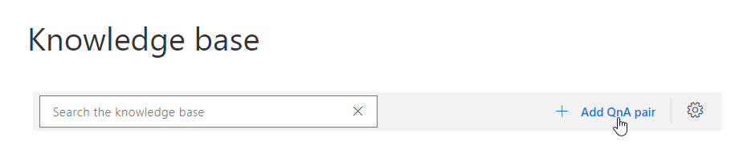

Image | Step
--- | ---
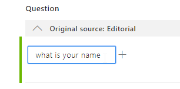 | Under "Question", type "what is your name"
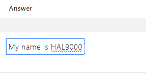 | Under "Answer", type "My name is HAL9000"
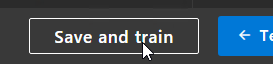 | Click "Save and train" at the top
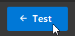 | Click "Test"
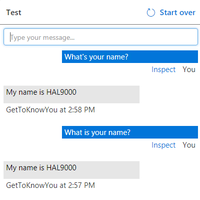 | Chat with HAL9000. Notice how he respects variations in your question
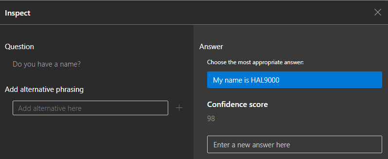 | Click "Inspect" to see how it interpreted your question
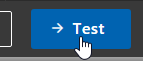 | When you're done, click "Test" again to hide the panel

### Lab1 Module 3 Bonus Exercise 1

When inspecting the answer to “Do you have a name?” Have HAL9000 answer “Yes, I have a name. My friends call me HAL. You may call me HAL9000.”

> Hint: In the "Answer" section of the inspect window, you can enter an alternative answer. Don't forget to "Save and train" to see your result.

### Lab1 Module 3 Bonus Exercise 2

Brainstorm with a partner to add alternative phrasings to the name question

### Lab1 Module 3 Bonus Exercise 3

Explore the Settings section of your KB. Export the knowledge base file and inspect it.

## Module 4: Connect a bot to the QnA App Service

In this module, we create a new QnA service and import a pre-configured file. We then will create a new bot project and connect it to the QnA service.

### Exercise 1: Bootstrap the Bot Properly

Bootstrapping your bot service requires familiarity with ASP.Net Core 2.x middleware. This exercise will help you understand some of the most basic middleware configuration for the Bot Framework. It will also correct some of the deficiencies in the template's base configuration code.

#### L1M4E1 Step 1

Rename the class `HalBot9000Bot` to simply `HalBot`. Rename the file HalBot.cs

#### L1M4E1 Step 2

Create a folder called State, and add a file named `UserProfile.cs`. Add the following code:

``` csharp
namespace HalBot9000.State
{
    public class UserProfile
    {
        public string Name { get; set; }
    }
}
```

> A state file is a simple object that stores state. There are [three built-in scopes for state](https://docs.microsoft.com/en-us/azure/bot-service/bot-builder-concept-state?view=azure-bot-service-4.0#state-management): User, Conversation, and Private Conversation. In addition, there are [three built-in options for state storage](https://docs.microsoft.com/en-us/azure/bot-service/bot-builder-concept-state?view=azure-bot-service-4.0#storage-layer): Memory, Azure Blob, and Cosmos DB. For the purpose of this module, we will only be using User scope and Memory storage.

#### L1M4E1 Step 3

Replace the code in `HalBot9000Accessors.cs` with the following:

``` csharp
using System;
using HalBot9000.State;
using Microsoft.Bot.Builder;

namespace HalBot9000
{
    public class HalBot9000Accessors
    {
        public HalBot9000Accessors(UserState userState)
        {
            UserState = userState ?? throw new ArgumentNullException(nameof(userState));
        }

        public static string UserProfileStateName { get; } = $"{nameof(HalBot9000Accessors)}.UserProfileState";

        public IStatePropertyAccessor<UserProfile> UserProfile { get; set; }

        public UserState UserState { get; }
    }
}
```

> `IStateProperyAccessor` will manage the lifecycle of the state object. We'll inject `HalBot9000Accessors` into our bot class, and get state from the exposed `IStatePropertyAccessor` properties. This takes advantage of the ASP.Net Core middleware architecture to simplify consumption on the bot. While it may seem a little contrived at first, the downstream benefits in terms of productivity are significant.

#### L1M4E1 Step 4

In `Startup.cs`, replace the contents of the method `ConfigureServices` with the following:

``` csharp
// We're going to use MemoryStorage here. This is really only suitable for development.
// In a future lab, we'll switch to more robust options.
IStorage storage = new MemoryStorage();

// Configures the bot
services.AddBot<HalBot9000Bot>(options =>
{
    var secretKey = Configuration.GetSection("botFileSecret")?.Value;
    var botFilePath = Configuration.GetSection("botFilePath")?.Value;

    // Loads .bot configuration file and adds a singleton that your Bot can access through dependency injection.
    var botConfig = BotConfiguration.Load(botFilePath ?? @".\HalBot9000.bot", secretKey);
    services.AddSingleton(sp =>
        botConfig ??
        throw new InvalidOperationException("The .bot config file could not be loaded."));

    // Retrieve current endpoint.
    var environment = _isProduction ? "production" : "development";
    var service =
        botConfig.Services.FirstOrDefault(s => s.Type == "endpoint" && s.Name == environment);
    if (!(service is EndpointService endpointService))
        throw new InvalidOperationException(
            $"The .bot file does not contain an endpoint with name '{environment}'.");

    options.CredentialProvider =
        new SimpleCredentialProvider(endpointService.AppId, endpointService.AppPassword);

    // Creates a logger for the application to use.
    ILogger logger = _loggerFactory.CreateLogger<HalBot9000Bot>();

    // Catches any errors that occur during a conversation turn and logs them.
    options.OnTurnError = async (context, exception) =>
    {
        logger.LogError($"Exception caught : {exception}");
        await context.SendActivityAsync("Sorry, it looks like something went wrong.");
    };
});

// This adds a singleton instance of HalBot9000Accessors to dependency injection
services.AddSingleton(sp =>
{
    // Initializes the user state object. This manages the lifecycle of objects scoped to a user.
    var userState = new UserState(storage);

    // Creates a property accessor for UserProfile that is scoped to the user
    var userProfilePropertyAccessor =
        userState.CreateProperty<UserProfile>(HalBot9000Accessors.UserProfileStateName);

    var accessors = new HalBot9000Accessors(userState)
    {
        UserProfile = userProfilePropertyAccessor
    };

    return accessors;
});
```

> As of 2019-01-23, the EchoBot template uses an obsolete method for managing state objects. This code is aligned with the documented best practices, which relies on the dependency injection middleware to simplify access to the property accessors.

#### L1M4E1 Step 5

In `HalBot.cs`, replace the contents of `OnTurnAsync` with the following code:

``` csharp
if (turnContext.Activity.Type == ActivityTypes.Message)
{
    // Get the state from the accessor. If it doesn't exist in this context, create it.
    // Note, the creation of the state object should only be done in the "defaultValueFactory" parameter.
    // If you create it outside of that Func, it won't be scoped properly.
    var state = await _accessors.UserProfile.GetAsync(turnContext, () => new UserProfile(), cancellationToken);

    // Bump the user's total turn count.
    state.TotalTurnCount++;

    // Set the property using the accessor.
    await _accessors.UserProfile.SetAsync(turnContext, state, cancellationToken);

    // Save the new turn count into the user state.
    await _accessors.UserState.SaveChangesAsync(turnContext, cancellationToken: cancellationToken);

    // Echo back to the user whatever they typed.
    var responseMessage = $"Total turns {state.TotalTurnCount}: You sent '{turnContext.Activity.Text}'\n";
    await turnContext.SendActivityAsync(responseMessage, cancellationToken: cancellationToken);
}
else
{
    await turnContext.SendActivityAsync($"{turnContext.Activity.Type} event detected", cancellationToken: cancellationToken);
}
```

> Some differences from the template: 1) Added cancellationToken to any async call to follow best practices. 2) Switched from ConversationState to UserState to simplify things. We'll add ConversationState back later.

#### L1M4E1 Step 6

Delete the file CounterState.cs

#### L1M4E1 Step 7

Run the code and test the bot using the Bot Framework Emulator.

### Exercise 2: Import & Publish QnA

#### L1M4E2 Step 1

In QnA Maker (www.qnamaker.ai), click “Create a new knowledge base”

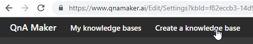

#### L1M4E2 Step 2

Select the options for "STEP 2"

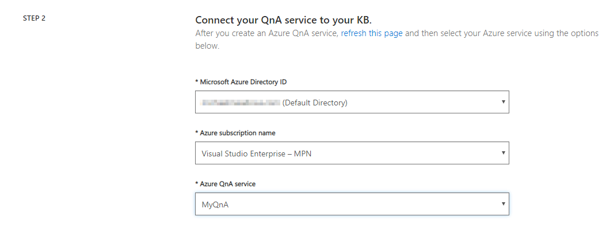

#### L1M4E2 Step 3

Name the KB "HAL Bot 9000"

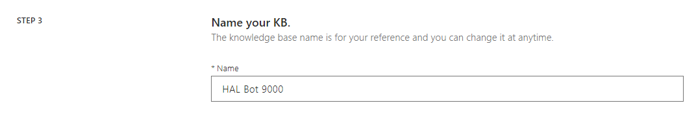

#### L1M4E2 Step 4

In "STEP 4", you can connect to a URL or upload a file during setup. We'll skip this step and connect after the KB is set up.

#### L1M4E2 Step 5

In "STEP 5", create the KB

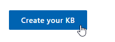

#### L1M4E2 Step 6

Go to "Settings"


#### L1M4E2 Step 7

Add KB file by URL or file

**By File:**

Click "Add File" under "File Name"

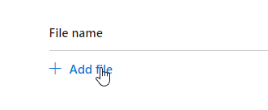

If you pulled the lab content from GitHub, you can find the file in \labs\lab1\module4\models\HAL9000_QnA.tsv

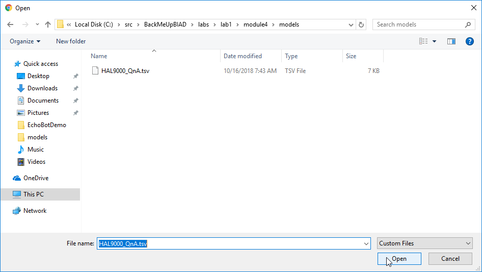

Click "Save and train"

**By URL**

In the “URL” text box, paste the following URL: https://raw.githubusercontent.com/BlueMetal/BackMeUpBIAD/master/labs/lab1/module4/models/HAL9000_QnA.tsv

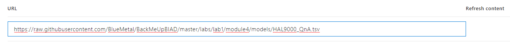

Click "Save and train"

#### L1M4E2 Step 8

Return to "EDIT" to see the questions and answers populated.

#### L1M4E2 Step 9

Click on "PUBLISH", then on the "Publish" button

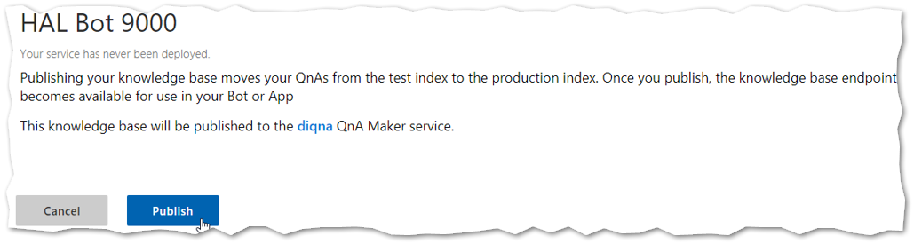

### Exercise 3: Create and Prepare Project

#### L1M4E3 Step 1

Create a new "Bot Builder Echo Bot V4" project

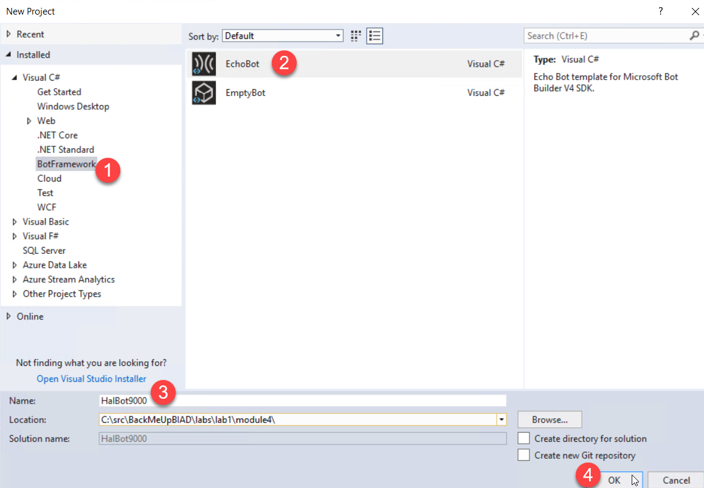

#### L1M4E3 Step 2

Click “Managed NuGet Packages” in the “Dependencies” context menu for the project.

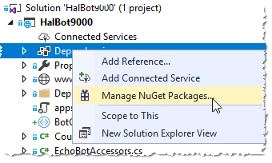

#### L1M4E3 Step 3

Navigate to “Browse”, and add “Microsoft.Bot.Builder.AI.QnA”

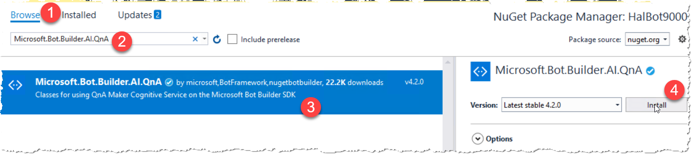

### Exercise 4: Prepare Project for QnA

#### L1M4E4 Step 1

Change the name of EchoWithCounterBot to HalBot

#### L1M4E4 Step 2

Locate “HalBot9000.bot”. Paste the following configuration at the end of the “services” collection.

``` json
{
    "type": "qna",
    "name": "hal-bot-9000",
    "kbId": "",
    "endpointKey": "",
    "hostname": "",
    "id": "2"
}
```

#### L1M4E4 Step 3

In the KB you just created on https://www.qnamaker.ai, navigate to “SETTINGS” to get “kbID”, “endpointKey”, and “hostname”

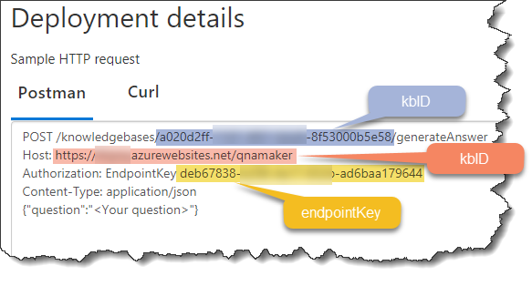

#### L1M4E4 Step 4

In the `ConfigureServices` method of  `Startup.cs`, find the block that configures the bot `services.AddBot<HalBot>(options =>`. Replace the entire block with the following:

``` csharp
// declare these here, so we can add them to the services collection outside of the "AddBot" block.
// If you try to do "services.AddSingleton" inside of the AddBot block, the HalBot constructor will fail
// to get the QnAMaker instance
BotConfiguration botConfig = null;
QnAMaker qnaMaker = null;

// Configures the bot
services.AddBot<HalBot>(options =>
{
    var secretKey = Configuration.GetSection("botFileSecret")?.Value;
    var botFilePath = Configuration.GetSection("botFilePath")?.Value;

    // Loads .bot configuration file and adds a singleton that your Bot can access through dependency injection.
    botConfig = BotConfiguration.Load(botFilePath ?? @".\HalBot9000.bot", secretKey);
    
    // Retrieve current endpoint.
    var environment = _isProduction ? "production" : "development";

    foreach (var serviceConfig in botConfig.Services)
    {
        switch (serviceConfig.Type)
        {
            case ServiceTypes.Endpoint:
                if (serviceConfig is EndpointService endpointService)
                {
                    // initialize the credential provider for the bot endpoint
                    options.CredentialProvider =
                        new SimpleCredentialProvider(endpointService.AppId, endpointService.AppPassword);
                }
                break;
            case ServiceTypes.QnA:
                if (serviceConfig is QnAMakerService qnaMakerService)
                {
                    // creates a QnA Maker endpoint and allows it to be injected as a singleton
                    var qnaEndpoint = new QnAMakerEndpoint
                    {
                        Host = qnaMakerService.Hostname,
                        EndpointKey = qnaMakerService.EndpointKey,
                        KnowledgeBaseId = qnaMakerService.KbId
                    };
                    qnaMaker = new QnAMaker(qnaEndpoint);
                }
                break;
            default:
                throw new NotImplementedException($"The service type {serviceConfig.Type} is not supported by this bot.");
        }
    }

    // Creates a logger for the application to use.
    ILogger logger = _loggerFactory.CreateLogger<HalBot>();

    // Catches any errors that occur during a conversation turn and logs them.
    options.OnTurnError = async (context, exception) =>
    {
        logger.LogError($"Exception caught : {exception}");
        await context.SendActivityAsync("Sorry, it looks like something went wrong.");
    };
});

services.AddSingleton(sp =>
    botConfig ??
    throw new InvalidOperationException("The .bot config file could not be loaded."));
services.AddSingleton(sp =>
    qnaMaker ?? throw new InvalidOperationException(
        "The QnAMaker was never initialized. Missing configuration in the .bot config file."));
```

> This step accesses the JSON data in the *.bot file to configure the bot. It relies heavily on convention, but works fairly well for simplifying configuration.

#### L1M4E4 Step 5

Add QnAMaker to the constructor and state of the HalBot class

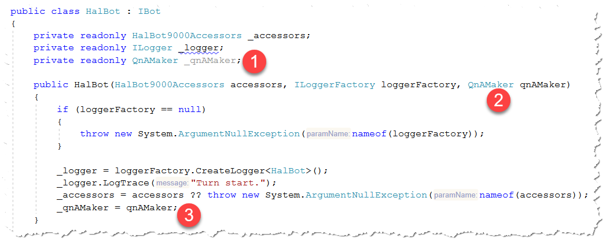

   1. Add to fields
   1. Add to constructor signature
   1. Add to constructor body

#### L1M4E4 Step 6

Replace the contents of the method `OnTurnAsync` in `HalBot.cs` with the following:

``` csharp
// we only care about messages in this exercise
if (turnContext.Activity.Type == ActivityTypes.Message)
{
    // It's possible to get blank messages.
    if (string.IsNullOrWhiteSpace(turnContext.Activity.Text))
    {
        await turnContext.SendActivityAsync(MessageFactory.Text("This doesn't work unless you say something first."), cancellationToken);
        return;
    }

    // Here's where we actually call out to the QnA Maker service to get an answer.
    var results = await _qnAMaker.GetAnswersAsync(turnContext).ConfigureAwait(false);

    if (results.Any())
    {
        // If there is a result, we get the answer with the highest score (best match)
        var topResult = results.First();
        await turnContext.SendActivityAsync(MessageFactory.Text(topResult.Answer), cancellationToken);
    }
    else
    {
        // If there's no answer, say so.
        await turnContext.SendActivityAsync(MessageFactory.Text("I'm sorry Dave, I don't understand you."), cancellationToken);
    }
}
else
{
    await turnContext.SendActivityAsync($"{turnContext.Activity.Type} event detected", cancellationToken: cancellationToken);
}
```

#### L1M4E4 Step 7

Run the code and test the bot using the Bot Framework Emulator.

### Lab1 Module 4 Bonus Exercise 1

Check out the GitHub Project https://github.com/Microsoft/BotBuilder-PersonalityChat/tree/master/CSharp/Datasets. Add a chitchat dataset to your service.

### Lab1 Module 4 Bonus Exercise 2

Explore the documentation for chit chat (https://docs.microsoft.com/en-us/azure/cognitive-services/qnamaker/how-to/chit-chat-knowledge-base) and augment the chit chat you added in the previous exercise with new QnA

[<< Home](README.md) | Lab 1 | [Lab 2](Lab2.md) | [Lab 3](Lab3.md)